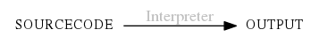
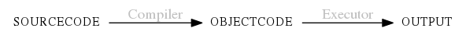

# The way of the program

1. **The differences between **interpreters** and **compilers**?**
   
   
   

2. **What is a program?**

3. **What is debugging?**
   
   程序中可能会出现的三种类型的错误：
   1. *Syntax errors*
   2. *Runtime errors*：This error does not appear until after the program has started running.
   3. *Semantic errors*：It will run successfully in the sence that the computer will not generate any error messages, but it will not do the right thing.
      > **例如**：
      > The volume of a sphere with radius r is $$\frac{3}{4}πr^3$$. What is the volume of a sphere with radius 5? Hint: 392.7 is wrong! 
      > **注意**：Python 的整数除法是向下圆整的，我就在这里出了错误！
        ~~~ bash
        >>> import math
        >>> r = 5
        >>> (3.0 / 4) * math.pi * r ** 3
        294.5243112740431
        ~~~
   4. *Experimental debugging*

4. Formal and natural languages
   
5. The first program
